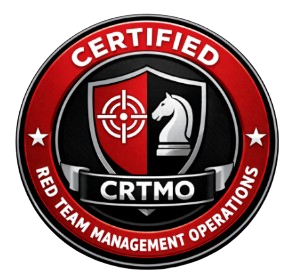

<!-- hero: monochrome ASCII portrait (types in) beside the extruded 3d ascii
     wordmark (wipes in left-to-right, then rocks on its vertical axis). -->

<h1><b>AMAL AZEES</b></h1>

<table border="0">
  <tr>
    <td width="330" valign="top">
      
    </td>
    <td valign="middle">
      
<b>I'm a Computer Science (BTech) student and a Diploma graduate in Electronics Engineering. I'm CICSA-certified in Cyber SOC Analysis, with 5 cybersecurity certifications earned in the past 12 months. Driven by a passion for securing digital infrastructure, I combine my academic engineering foundation with self-directed, hands-on experience in penetration testing and hardware security development. I am adept at analyzing threats, configuring security tools, and collaborating on technical solutions. I am currently open to IT and Cybersecurity roles, including internships and entry-level positions where I can contribute to a proactive security posture.</b>

       
      
<i>"Every line of code should make something better."</i>

    </td>
  </tr>
</table>

 

<h2 align="center">Certifications & Skills</h2>

  
  &nbsp;&nbsp;&nbsp;&nbsp;
  
  &nbsp;&nbsp;&nbsp;&nbsp;
  

 

  
  
  
  
  

 
<h2 align="center">Connect & Links</h2>

  
  &nbsp;&nbsp;&nbsp;&nbsp;
  
  &nbsp;&nbsp;&nbsp;&nbsp;
  

 

