<!-- hero: monochrome ASCII portrait (types in) beside the extruded 3d ascii
     wordmark (wipes in left-to-right, then rocks on its vertical axis). -->

<h3><code>amalazees@github ~ $ whoami</code></h3>

<table>
<tr>
<td valign="top"></td>
<td valign="top"></td>
</tr>
</table>

 

<b>Certified Cyber Security SOC Analyst · Diploma in Electronics Engineering · CSE Student · Hardware Pentester · Embedded Systems Enthusiast</b>

<i>"Every line of code should make something better."</i>

 

<!-- animated contribution graph -->

<h3><code>amalazees@github ~ $ ./contributions.sh</code></h3>

 
 

<h3><code>amalazees@github ~ $ ./certifications_and_skills.sh</code></h3>

  
  
  
  
  

 
<h3><code>amalazees@github ~ $ ./links.sh</code></h3>

 

